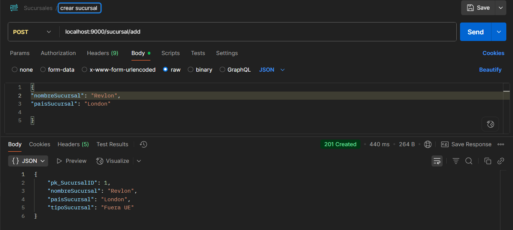
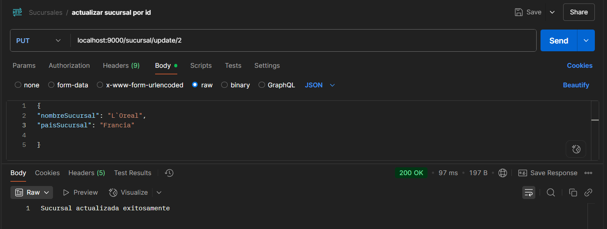
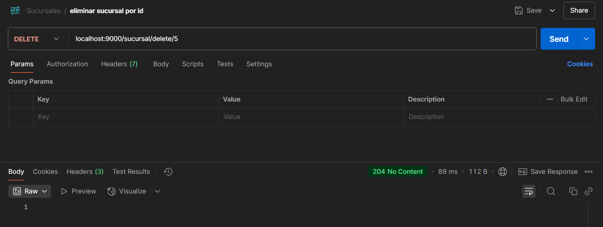
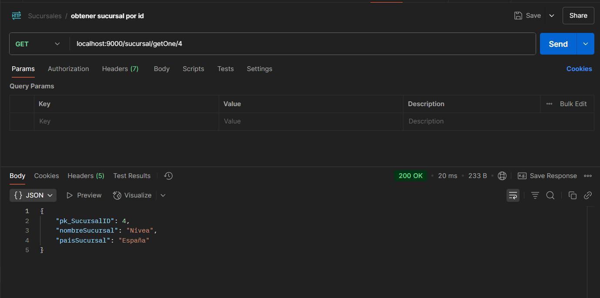
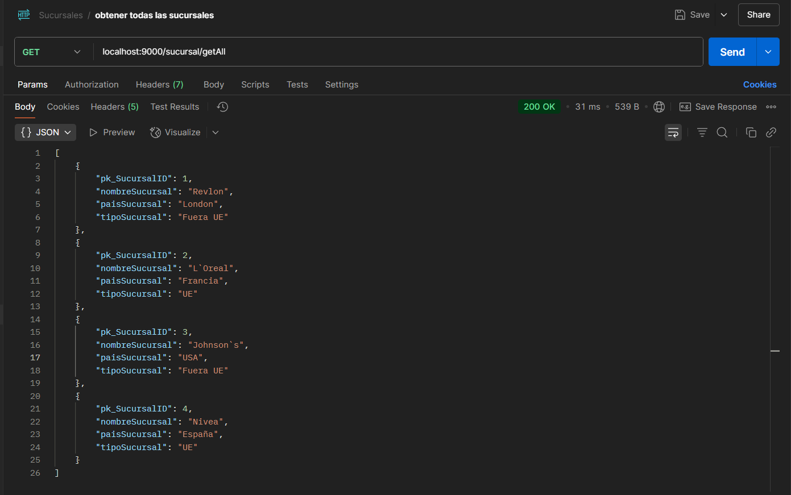
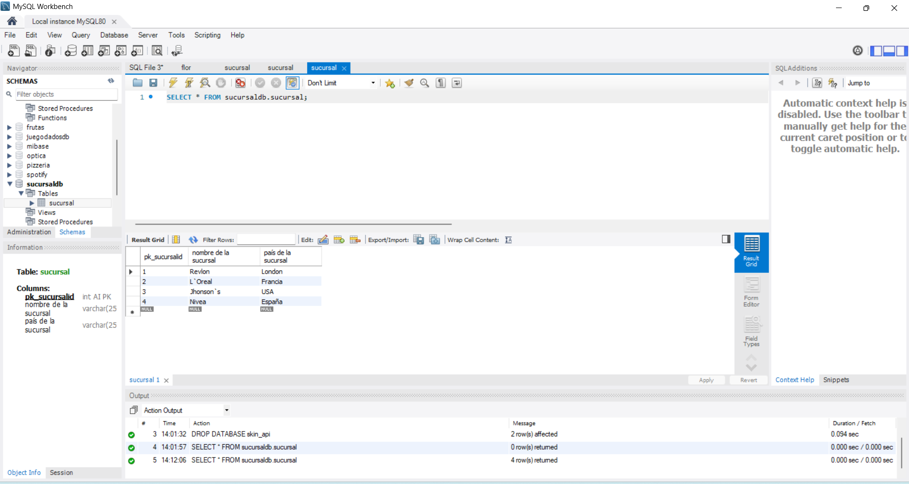
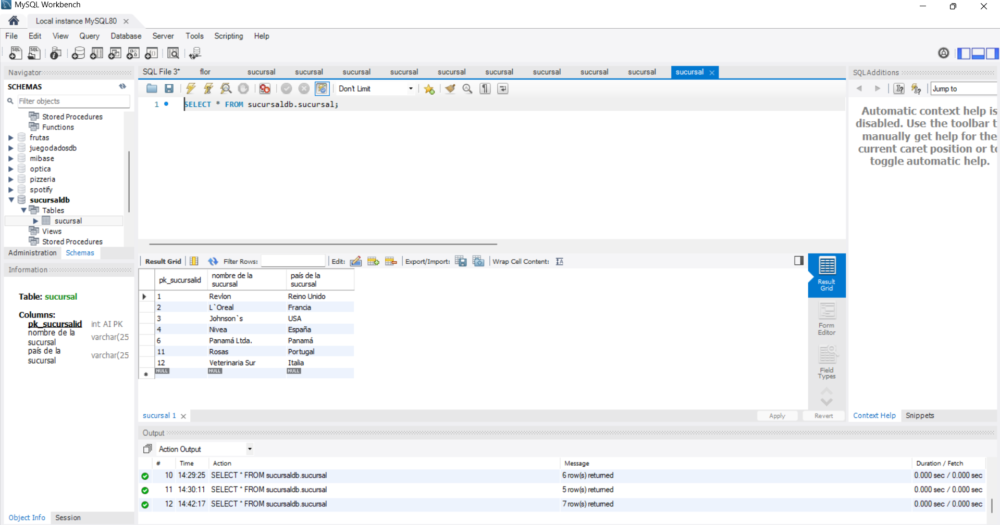

# 🚀 Sprint 5 · Tasca 1 · Nivel 1: API REST con Spring Boot y Thymeleaf - CRUD con MySQL

---

## 📄 Descripción

Este proyecto consiste en una aplicación CRUD desarrollada con Spring Boot que permite gestionar entidades de tipo "Sucursal". Se implementan dos interfaces: una API REST accesible mediante clientes HTTP (como Postman), y una interfaz web con vistas Thymeleaf para interacción a través del navegador.

La aplicación está conectada a una base de datos MySQL y permite crear, leer, actualizar y eliminar sucursales. Cada sucursal tiene un nombre, un país y un campo calculado automáticamente que clasifica la sucursal como "UE" o "Fuera UE", según su país de origen.


---

## 🎯 Objetivos

- Protocolo HTTP / REST.
- JPA.
- CRUD con Spring.
- MySQL.
- Thymeleaf.

---

## 💻 Tecnologías utilizadas

- **Java 17**
- **Spring Boot** (última versión estable)
- **Maven** (gestor de dependencias)
- **IntelliJ IDEA**
- **Postman** (para pruebas HTTP)
- **MySQL Workbench**
- **Thymeleaf**
---

## 📋 Requisitos

- Java JDK 17 instalado
- Maven instalado y configurado en el sistema
- IntelliJ IDEA o Eclipse
- Postman o cualquier cliente HTTP para probar la API
- MySQL Drivers
- Thymeleaf

---

## 📁 Estructura del proyecto

```bash
S05T01N01BustamanteGabriela/
├── .idea/
├── .mvn/
├── screenshots/
│   ├── add_sucursal.png
│   ├── delete_sucursal.png
│   ├── get_all_sucursales.png
│   ├── get_one_sucursal.png
│   ├── mysql_sucursaldb_table_before_update.png
│   ├── mysql_sucursaldb_table_after_update.png
│   └── update_sucursal.png
├── src/
│   ├── main/
│   │   ├── java/
│   │   │   └── cat/itacademy/barcelonactiva/bustamante/gabriela/s05/t01/n01/S05T01N01BustamanteGabriela/
│   │   │       ├── controllers/
│   │   │       │   ├── SucursalController.java
│   │   │       │   └── WebController.java
│   │   │       ├── exception/
│   │   │       │   ├── SucursalNotFoundException.java
│   │   │       │   └── GlobalExceptionHandler.java
│   │   │       ├── model/
│   │   │       │   ├── domain/
│   │   │       │   │   └── Sucursal.java
│   │   │       │   └── dto/
│   │   │       │       └── SucursalDto.java
│   │   │       ├── repository/
│   │   │       │   └── SucursalRepositorio.java
│   │   │       ├── services/
│   │   │       │   ├── SucursalServicio.java
│   │   │       │   └── SucursalServicioImpl.java
│   │   │       └── S05T01N01BustamanteGabrielaApplication.java
│   │   └── resources/
│   │       ├── templates/
│   │       │   ├── delete.html
│   │       │   ├── editForm.html
│   │       │   ├── form.html
│   │       │   └── list.html
│   │       └── application.properties
│   └── test/
│       └── java/
│           └── cat/itacademy/barcelonactiva/bustamante/gabriela/s05/t01/n01/S05T01N01BustamanteGabriela/
│               └── S05T01N01BustamanteGabrielaApplicationTests.java
├── .gitignore
├── HELP.md
├── mvnw
├── mvnw.cmd
├── pom.xml
└── README.md
```

---
# 📁 Estructura de controladores

- **SucursalController** – API REST (`/sucursal/...`)
- **WebController** – Vistas HTML (`/web/sucursales/...`)

---

## 🚀 Funcionalidades de la API

- ➕ **POST** `/sucursal/add`  
  Crea una nueva sucursal.
- ✏️ **PUT** `/sucursal/update/{id}`  
  Actualiza una sucursal existente por su ID.
- ❌ **DELETE** `/sucursal/delete/{id}`  
  Elimina una sucursal por su ID.
- 🔍 **GET** `/sucursal/getOne/{id}`  
  Obtiene una sucursal por ID.
- 📋 **GET** `/sucursal/getAll`  
  Lista todas las sucursales.


---

## 🧰 Comandos Maven importantes

Desde la terminal, en el directorio del proyecto, se pueden ejecutar:

- `mvn compile` — Compila el proyecto
- `mvn package` — Empaqueta el proyecto
- `mvn clean` — Limpia los archivos compilados
- `mvn spring-boot:run` — Ejecuta la aplicación Spring Boot

---
## 🛠️ Instalación

1. Clona el repositorio:  
   `git clone https://github.com/GabyB73/Sprint5Tasca1Nivel1.git`
2. Abre el proyecto en IntelliJ o Eclipse.
3. Asegúrate de que el archivo `pom.xml` está presente y actualizado.
4. Asegúrate de tener una base de datos MySQL en ejecución.
5. Crea la base de datos si no existe (nombre según el `application.properties`).
6. Configura las credenciales de conexión a MySQL en el archivo `src/main/resources/application.properties`.
7. Ejecuta la aplicación:
   `mvn spring-boot:run`
   o desde el botón de "Run" en tu IDE.

---

## ▶️ Ejecución

Una vez ejecutado, puedes probar la API y la interfaz web.
### 📫 Endpoints REST (Postman)
```bash
POST    http://localhost:9000/sucursal/add
PUT     http://localhost:9000/sucursal/update/{id}
DELETE  http://localhost:9000/sucursal/delete/{id}
GET     http://localhost:9000/sucursal/getOne/{id}
GET     http://localhost:9000/sucursal/getAll
```

📌 Asegúrate de enviar los datos como JSON en las peticiones POST y PUT.
### 🌐 Vistas Web (Thymeleaf – navegador)
```bash
GET     http://localhost:9000/web/sucursales/list
GET     http://localhost:9000/web/sucursales/form
GET     http://localhost:9000/web/sucursales/edit/{id}
GET     http://localhost:9000/web/sucursales/delete/{id}
```

📌 Estas rutas permiten gestionar sucursales a través del navegador con formularios HTML. Las rutas de alta y edición realizan envíos POST desde los formularios de Thymeleaf.

---
### 📸 Capturas de pantalla

#### ➕ Añadir sucursal


#### ✏️ Actualizar sucursal


#### ❌ Eliminar sucursal


#### 🔍 Obtener una sucursal


#### 📋 Obtener todas las sucursales


#### 🧪 MySQL Workbench


#### 🧪 MySQL Workbench

#### 🎥 Thymeleaf
📺 [Ver demostración en vídeo de la interfaz web (Google Drive)](https://drive.google.com/file/d/1tmyRO8Vlanx8Fm7XCS1UEbsB4-jMDIYV/view?usp=sharing)

---

## 🔗 Recursos utilizados

1- https://www.baeldung.com/spring-boot-crud-thymeleaf

2- https://www.baeldung.com/spring-component-repository-service

3- https://dzone.com/articles/spring-boot-with-spring-data-jpa

---

## 🤝 Contribuciones

Este es un proyecto de práctica del bootcamp IT Academy.    
Las contribuciones no son necesarias, pero puedes hacer un fork o dejar comentarios si lo deseas.
  
---

## 👩‍💻 Autora

Desarrollado por **[Gabriela Bustamante](https://github.com/GabyB73)**  
Bootcamp de Desarrollo Java - IT Academy  

